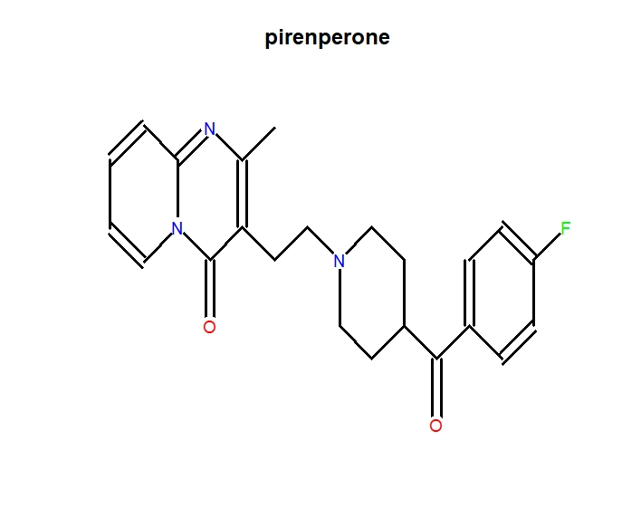

```{r, include = FALSE}
knitr::opts_chunk$set(
  collapse = TRUE,
  comment = "#>"
)
```

```{r setup}
library(SubtypeDrug)
```

## Introduction
The **SubtypeDrug** package is a systematic biological tool to optimize cancer subtype-specific drugs. The main capabilities of this tool are as follows:<br/>
  
    1. Identifying drug-regulated subpathways.
    
    2. Infer patient-specific subpathway activity profiles. 
    
    3. Calculating drug-disease reverse association score.
    
    4. Identifying cancer subtype-specific drugs. 
    
    5. Visualization of results.

<br/>

## Identifying drug-regulated subpathways
We downloaded all pathways from the KEGG database in XML format. For each KEGG pathway map, we converted each pathway into a gene-gene network with genes as nodes and bilological relationships as edges. For metabolic pathways, two genes (enzymes) are connected by an edge if there is a common compound in their corresponding reaction. For non-metabolic pathways, two genes are connected by an edge if they have a relationship (such as interaction, binding or modification, etc.) indicated in the relation element of the XML file. We used the k-clique algorithm in SubpathwayMiner package to detect the subpathways, in which the distance between any two nodes is no greater than k (The default parameter k of the method was used in the study) [@Chunquan2009subpathwayminer]. In order to remove redundant information, we eliminated smaller subpathways with more than 80% overlap between subpathways that belong to the same pathway [@Syed2018]. The subpathway data was stored in our developed R-based “SubtypeDrugData” package, which is publicly available on Github (https://github.com/hanjunwei-lab/SubtypeDrugData).<br/>
CMap build 02 raw data is downloaded from the CMap website [@lamb2006connectivity]. After normalizing gene expression profiles, the fold-change (FC) method was used to calculate  differentially expressed levels of genes between the drug treatment (distinguish different concentrations of the same drug) and the control groups. For a given drug at a specific concentration, the genes in each subpathway were mapped to the ranked gene list of the drug repectively. We then used Gene Set Enrichment Analysis (GSEA) [@subramanian2005gene] to identify the subpathways regulated by the drug. A subpathway with a greater positive or negative enrichment score (ES) indicates that the drug may activate or inhibit (up- or down-regulate) this subpathway more strongly. An empirical gene-based permutation test procedure was used to estimate the statistically significance (p-value) of the ES of subpathway, which reflects the extent of association between the subpathway and drug. Finally all results of the drug-regulated subpathway were constituted the drug-subpatway association data which was stored in our SubtypeDrugData package (https://github.com/hanjunwei-lab/SubtypeDrugData).<br/>
The subpathway data and the drug-subpatway association data can be downloaded and used by the following code:

```
## Download SubtypeDrugData package from GitHub.
require(devtools)
install_github("hanjunwei-lab/SubtypeDrugData",force = TRUE)
require(SubtypeDrugData)
## Get subpathway list data.
## If the gene expression profile contains gene Symbol.
data(SpwSymbolList)
## If the gene expression profile contains gene Entrezid.
data(SpwEntrezidList)
## Get drug subpathway association data.
data(DrugSpwData)
```

##  Infer patient-specific subpathway activity profiles. 

To identify cancer subtype-specific drugs, the SubtypeDrug package requires gene expression profiles with normal and cancer samples with subtype labels. The SubtypeDrug package provided two methods: gene set enrichment analysis (GSVA) [@hanzelmann2013gsva] and single sample GSEA (ssGSEA) [@barbie2009systematic], to infer patient-specific subpathway activity profiles from the gene expression profiles. For each subpathway, the differential activity value of each sample was estimated by comparing its activity with the mean and standard deviation of subpathway activities of accumulated normal samples [@ahn2014personalized]. The formula is as follows:
$${\mathop{{Z}}\nolimits_{{ij}}=\frac{{\mathop{{Sub}}\nolimits_{{ij}}-mean{ \left( {S\mathop{{ub}}\nolimits_{{i,normal}}} \right) }}}{{stdev{ \left( {\mathop{{Sub}}\nolimits_{{i,normal}}} \right) }}}}$$
where $Sub_{ij}$ is the activity value of $i$ th subpathway in the $j$ th cancer sample and $Sub_{i,normal}$ is a vector of activity value of $i$ th subpahtway in the normal samples. The $Z_{ij}$ score denotes differential activity extent of the subpathway $i$ for cancer sample $j$ relative to normal samples.


## Calculating drug-disease reverse association score.

To test if a drug could treat a specific cancer sample, we defined a drug-disease reverse association score ($RS$) to reflect the treatment extent of drug at the subpathway level. Specifically, for a given cancer sample $j$, the subpathways were ranked in descending order based on the differential activity score to form a subpathway list $L_j$. We mapped the up- and down-regulated subpathways induced by a drug respectively to the ranked list $L_j$ to calculate RS. We provided two methods to estimate this score:

  1. **Non-weighed estimate method.** 
  For the set of up-regulated subpathways of the $d$ th drug, we construct a vector $V$ of the position ($1...q$) of each subpathway tags in the ordered list $L_j$ and sort these components in ascending order such that $V(g)$ is the position of tag $g$ ($p$ is the number of up-regulated subpathways of the $d$ th drug and $g=1,2,...p$). The Kolmogorov-Smirnov (*KS*) statistic of the up-regulation subpathway of drug ($KS_d^{up}$) is calculated as follows:
  
$${D\mathop{{}}\nolimits_{{1}}=max\mathop{{}}\nolimits_{{g=1}}^{{p}}{ \left[ {\frac{{g}}{{p}}-\frac{{V{ \left( {g} \right) }}}{{q}}} \right] }}$$


$${\mathop{{D}}\nolimits_{{2}}=max\mathop{{}}\nolimits_{{g=1}}^{{p}}{ \left[ {\frac{{V{ \left( {g} \right) }}}{{q}}-\frac{{{ \left( {g-1} \right) }}}{{p}}} \right] }}$$


We set $KS_d^{up}$=$D_{1}$, if $D_{1}$>$D_{2}$ or $KS_d^{up}$=$-D_{2}$, if $D_{1}$<$D_{2}$. Like the above process, $KS_d^{down}$ is also calculated for the down-regulation subpathways of drug. The drug-disease reverse association score ($RS_{dj}$) of the $d$ th drug in the j th cancer sample is $RS_{dj}=KS_d^{up}-KS_d^{down}$.
  
  2. **Weighed estimate method.**
  For the ordered subpathway list of sample $j$, $L_j$, the drug up- and down-regulated subpathways are mapped to the list $L_j$ repectively. We use the GSEA strategy to calculate the weight $KS$ statistics of the drug up- and down-regulated subpathway set (termed $ES^{up}$ and $ES^{down}$) with the subapthway differential activity score as weight. The RS is defined as:
  $RS_{dj}=ES_d^{up}-ES_d^{down}$
  
The magnitude of the $RS$ depends on the correlation of the drug with the disease. The greater negative score indicates the drug may treat the disease with a larger extent, and the positive score indicates the drug may promote disease development. To allow inter-drug comparisons with $RS_{dj}$, we further normalized the $RS$ for each drug as follows:  
  $$NS_{dj}=RS_{dj}/|max(RS_d)|, \text{where }RS_{dj}>0$$
  or 
  $$NS_{dj}=RS_{dj}/|min(RS_d)|, \text{where }RS_{dj}<0$$
where max($RS_d$) or min($RS_d$) is the maximum or minimum value of $RS$ of drug d across all samples.


## Identifying cancer subtype-specific drugs

###### Calculating the cancer subtype-specific drug score
For each drug, we calculated the $NS$ on each sample through the above method. Thus we obtained a normalized drug-disease reverse association matrix $M = (NS_{dj})$ with rows as drugs and columns as samples. For a given drug, the samples were ranked in the dataset to form a sample list $L$ according to decreasing $NS$. If the samples in a cancer subtype enrich at the negative/positive $NS$ region on the list $L$, the drug may potentially treat/promote this cancer subtype. This process implements comparison of $NS$ for the samples in different subtypes, and the different subtypes are competitive relationships in the list. To perform this sample set enrichment analysis, we defined a subype-specific drug score ($SDS$), and the formula of $SDS$ is as follows:

$${SDS\mathop{{}}\nolimits_{{t}}=\frac{{1}}{{\mathop{{ \beta }}\nolimits_{{t}}}}{\mathop{ \sum }\limits_{{j \in t}}{NS\mathop{{}}\nolimits_{{j}}}}}$$

where, $\beta_{t}$ is the number of samples in the *t* th cancer subtype, $NS_j$ is the normalized drug-disease reverse association score of *j* th cancer sample for the *t* th cancer subtype. The greater the negative $SDS$ indicates the drug may have potentially stronger the potential therapeutic effect on the cancer subtype $t$. Conversely, the greater positive $SDS_t$ indicates that the drug may have stronger side effects on this cancer subtype.<br/>

###### Estimating statistically significance level of sutype-specific drug score
We first estimated the statistical significance (S_Pvalue) of $SDS$ for each subtype by using an empirical sample-based permutation test procedure. Specifically, for a given drug, we permuted the class labels (subtype labels) of subpathway activity profiles, and recomputed the $SDS$ for each subtype. In the pakage, the default permutation times are set at 1000. This will produce a null distribution $SDS_{null}^*$ for all cancer subtypes. Based on law of large numbers, the $SDS_{null}^*$ follows an approximately normal distribution. Subsequently, the S_Pvalue of the observerd $SDS$ for each subtype is estimated based on the $SDS_{null}^*$. To correct for multiple comparisons, we adjusted the S_Pvalues of drugs for each subtype by using the false discovery rate (FDR) method proposed by Benjamini and Hochberg [@Benjamini1995].<br/>
	Furthermore, to evaluate the drug treatment effect, we constructed subpathway activity profiles that contains only one cancer subtype and normal samples. The fold change (FC) of subpathway activity between the cancer subtype and normal samples were calculated, and the subpathways were ranked in descending order of log2FC to form a list. For a given drug, the drug targeted up-regulated and down-regulated subpathways were mapped to the ranked subpathway list repectively, and the $RS$ was calculated, which reflects treatment effect of the drug on the subtype. Similarly, the permutation test procedure is also used to calculate the statistical significance (E_Pvalue) of $RS$ for each drug, and the E_FDR was then calculated. If the gene expression data only contains cancer and normal samples, this process could be used to identify cancer candidate drugs. Finally, the drugs with both S_FDR and E_FDR less than a given threshold will be deemed as cancer subtype-specific.
<br/>

Our method can identify not only cancer subtype-specific drugs in the datasets with multi-phenotype categories but also cancer-related drugs in the datasets with cancer and normal samples. Taking the simulative breast cancer data as an example, breast cancer-related and subtype-specific drug identification are as follows:
```{r}
require(GSVA)
require(parallel)
## Get simulated breast cancer gene expression profile data.
Geneexp<-get("Geneexp")
## Obtain sample subtype data and calculate breast cancer subtype-specific drugs.
Subtype_labels<-system.file("extdata", "Subtype_labels.cls", package = "SubtypeDrug")
```
```
# Identify breast subtype-specific drugs.
Subtype_drugs<-PrioSubtypeDrug(Geneexp,Subtype_labels,"Control",SpwSymbolList,
                               drug.spw.data=DrugSpwData,E_FDR=1,S_FDR=1)
```
```{r include=FALSE,echo=F}
Subtype_drugs<-get("Subtype_drugs")
```
```{r}
## Results display.
str(Subtype_drugs)
```

The PrioSubtypeDrug() function can also be used to identify breast cancer-related drugs in only two types of samples: breast cancer and normal.
```
Cancer_normal_labels<-system.file("extdata", "Cancer_normal_labels.cls", package = "SubtypeDrug")
Disease_drugs<-PrioSubtypeDrug(Geneexp,Cancer_normal_labels,"Control",SpwSymbolList,drug.spw.data=DrugSpwData,
                               E_FDR=1,S_FDR=1)
```
The function PrioSubtypeDrug() can also support user-defined data.
```{r}
## User-defined drug regulation data should resemble the structure below.
UserDS<-get("UserDS")
str(UserDS[1:5])
## Need to load gene set data consistent with drug regulation data.
UserGS<-get("UserGS")
str(UserGS[1:5])
Drugs<-PrioSubtypeDrug(Geneexp,Subtype_labels,"Control",UserGS,spw.min.sz=1,drug.spw.data=UserDS,drug.spw.min.sz=1,
                       E_FDR=1,S_FDR=1)
```

## Visualization

### Plot a heat map of normalized drug-disease reverse association scores for cancer samples

```{r fig.height=15, fig.width=10, message=FALSE, warning=FALSE}
require(pheatmap)
## Heat map of normalized disease-drug reverse association scores for all subtype-specific drugs.
plotDScoreHeatmap(data=Subtype_drugs,E_Pvalue.th=0.05,E_FDR.th=1,S_Pvalue.th=0.05,S_FDR.th=1,show.colnames = FALSE)
```

```{r fig.height=6, fig.width=10, message=FALSE, warning=FALSE}
## Plot only Basal subtype-specific drugs.
plotDScoreHeatmap(Subtype_drugs,subtype.label="Basal",SDS="all",E_Pvalue.th=0.05,E_FDR.th=1,S_Pvalue.th=0.05,S_FDR.th=1,show.colnames = FALSE)
```

### Plot heat map of patient-specific subpathway activity profiles of drug-regulated subpathway

```{r fig.height=8, fig.width=12}
## Plot a heat map of the individualized activity aberrance scores of subpathway regulated by drug pirenperone(1.02e-05M). 
## Basal-specific drugs pirenperone(1.02e-05M) regulated subpathways that show opposite activity from normal samples.
plotDSpwHeatmap(data=Subtype_drugs,drug.label="pirenperone(1.02e-05M)",subtype.label="Basal",show.colnames=FALSE)
```

### Plot a global graph of the drug

```{r fig.height=8, fig.width=9}
## Plot a global graph of the Basal-specific drug pirenperone(1.02e-05M).
plotGlobalGraph(data=Subtype_drugs,drug.label="pirenperone(1.02e-05M)")
```

### Polt a subpathway network graph

```{r fig.height=6, fig.width=6, message=FALSE, warning=FALSE}
require(igraph)
# plot network graph of the subpathway 00020_4.
plotSpwNetGraph(spwid="00020_4")
```

### Visualize the chemical structure of the drug

```
require(ChemmineR)
require(rvest)
## Plot the chemical structure of drug pirenperone.
Chem_str<-getDrugStructure(drug.label="pirenperone")
plot(Chem_str)
```

```{r echo=FALSE}

```


## References
